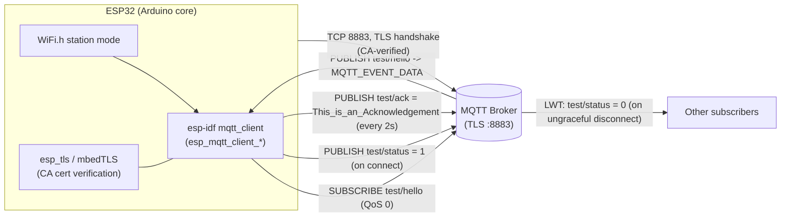

# ESP32 MQTT over TLS (ESP-IDF `mqtt_client`)

A minimal ESP32 example that connects to Wi-Fi, then connects to an MQTT
broker over TLS (port 8883) using the native ESP-IDF `mqtt_client`
component that ships inside the ESP32 Arduino core — not PubSubClient or
`WiFiClientSecure`. It subscribes to one topic, publishes a "hello" status
message and a Last Will and Testament (LWT) on connect, and repeatedly
publishes an acknowledgement message from the main loop.

There is no external sensor or actuator wired up in this sketch — it is a
connectivity/TLS reference example. The "data" flowing over MQTT is just
the fixed strings described below; swap in real sensor readings where the
publish calls are made if you build on top of this.

## What the firmware does

1. Joins Wi-Fi in station mode (`WIFI_SSID` / `WIFI_PASSWORD`).
2. Starts an ESP-IDF MQTT client configured for TLS (`MQTT_TRANSPORT_OVER_SSL`)
   against `MQTT_HOST:MQTT_PORT`, authenticating with `MQTT_USERNAME` /
   `MQTT_PASSWORD` and verifying the broker's certificate against a CA cert
   you supply (`MQTT_CA_CERT` in `secrets.h`).
3. Registers an event handler for `MQTT_EVENT_*` callbacks (connect,
   disconnect, subscribe, publish, incoming data, errors).
4. On `MQTT_EVENT_CONNECTED`:
   - Subscribes to `test/hello` (QoS 0).
   - Publishes `"1"` to `test/status` (QoS 0).
5. Registers `test/status` / `"0"` as the connection's LWT, so the broker
   publishes `"0"` to `test/status` if the device disconnects
   ungracefully.
6. In the main loop, publishes `"This_is_an_Acknowledgement"` to
   `test/ack` every 2 seconds.

These topics and payloads are unchanged from the original sketch — only
the ESP-IDF API calls and credential handling were modernized (see
"Modernization notes" below).

## Architecture



## Hardware requirements

- Any ESP32 development board (ESP32-WROOM-32, DevKitC, etc.) supported
  by the `esp32` Arduino/PlatformIO platform.
- USB cable for flashing/serial monitor.
- No external sensors/actuators are required to run this example as-is.
- Network access to an MQTT broker that supports TLS on port 8883 (e.g.
  Mosquitto with a TLS listener, AWS IoT Core, HiveMQ Cloud, etc.), and
  the CA certificate that signed that broker's server certificate.

## Required libraries / toolchain

- ESP32 Arduino core **3.x** (ESP-IDF 5.x), which provides:
  - `WiFi.h`
  - `mqtt_client.h` (`esp-idf` component `mqtt`), used via its C API
    directly — no separate PubSubClient/ArduinoJson dependency.
  - `esp_tls.h`, `esp_log.h`, `esp_event.h`, `esp_system.h`
- No third-party libraries beyond the Arduino core are required.

## Configure your credentials

Credentials and the CA certificate are kept out of the source file and
out of git:

```
cp src/secrets.example.h src/secrets.h
```

Edit `src/secrets.h` and fill in:

- `WIFI_SSID`, `WIFI_PASSWORD`
- `MQTT_HOST`, `MQTT_PORT`, `MQTT_USERNAME`, `MQTT_PASSWORD`
- `MQTT_CA_CERT` — paste the PEM CA certificate that signed your broker's
  TLS certificate.

`secrets.h` is listed in `.gitignore` and will never be committed.

If you'd rather trust the standard public CA bundle instead of pinning a
single CA certificate (e.g. connecting to a broker with a certificate
from a well-known public CA), you can use
`esp_crt_bundle_attach` instead — see the commented-out line in
`src/ESP32_SSL_MCU.ino` (`broker.verification.crt_bundle_attach`) and
enable the "Mbed TLS -> Certificate Bundle" option in `sdkconfig` (or
`board_build.embed_certs`/`build_flags` under PlatformIO).

## Build & flash

### PlatformIO (recommended)

A `platformio.ini` is included, targeting a generic `esp32dev` board.

```
pio run                 # build
pio run -t upload       # flash
pio device monitor      # serial monitor, 115200 baud
```

Change `board = esp32dev` in `platformio.ini` if you're using a specific
board variant (e.g. `esp32-s3-devkitc-1`).

### Arduino IDE / arduino-cli

The Arduino IDE requires the `.ino` file to live in a folder with the
same name as the sketch. Copy or symlink `src/` into a folder named
`ESP32_SSL_MCU/` (containing `ESP32_SSL_MCU.ino` and `secrets.h`) before
opening it in the IDE, or point `arduino-cli` at the `src/` directory
directly:

```
arduino-cli compile --fqbn esp32:esp32:esp32 src
arduino-cli upload -p <PORT> --fqbn esp32:esp32:esp32 src
```

Install the `esp32` board package (version 3.x) via Boards Manager /
`arduino-cli core install esp32:esp32` first.

**Note on verification:** this environment doesn't have PlatformIO or
arduino-cli installed, so the sketch could not be compiled as part of
this change. The code was reviewed against the ESP-IDF 5.x
`esp_mqtt_client_config_t` / event-registration API, but you should do a
first build/flash yourself before relying on it.

## Modernization notes

Compared to the original 2020 version of this sketch:

- **MQTT client config**: migrated from the old flat
  `esp_mqtt_client_config_t` (with `host`, `port`, `username`, `transport`,
  `lwt_topic`, etc. as top-level fields, and a `mqtt_cfg.event_handle`
  callback field) to the current ESP-IDF 5.x nested config
  (`broker.address.*`, `broker.verification.*`, `credentials.*`,
  `session.*`). The old flat fields and `event_handle` no longer exist in
  current ESP-IDF and would fail to compile against a modern core.
- **Event handling**: switched to `esp_mqtt_client_register_event()` with
  the standard `esp_event_handler_t` signature
  (`void (*)(void*, esp_event_base_t, int32_t, void*)`), which is the only
  supported mechanism now (the old direct `event_handle` callback field
  was removed).
- **Credentials & CA cert**: moved out of the source file into a
  git-ignored `secrets.h` (see `secrets.example.h`), instead of hardcoding
  placeholder strings directly in the `.ino`.
- **Cleanup**: removed a stray `#ifdef SECURE_MQTT/#else` block that set
  `MQTT_PORT` to `8883` in both branches (dead branching — same value
  either way), named topics/payloads as constants instead of repeated
  string literals, added an `MQTT_EVENT_ERROR` case, and removed an
  unreachable/incorrect comment about event registration "not implemented
  in current Arduino core" (it is implemented; the old code just wasn't
  using it).
- **No behavior change**: topics (`test/hello`, `test/status`,
  `test/ack`), QoS levels (0), publish payloads, keepalive (15s), and the
  2-second publish loop are all unchanged.
